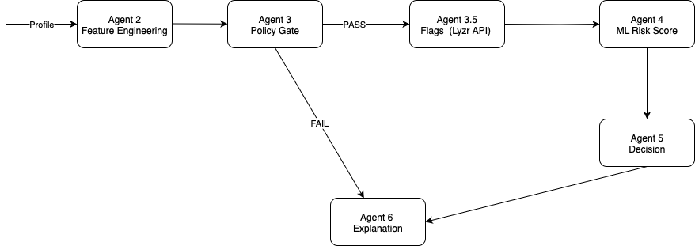

# Multi-Agent Credit Risk Automation System (PoC)

## Introduction  
**Context:** Developed during my internship at RootQuotient, this project delivers a proof-of-concept for automating BNPL credit risk underwriting.  

Manual BNPL underwriting is slow, inconsistent, and hard to audit. This PoC transforms the process into an end-to-end automated pipeline that is explainable — reducing decision times from hours to seconds.  

---

## Problem  
- **Manual Underwriting:** Reliance on human review leads to delays and inconsistencies  
- **Fragmented Data:** Applicant data scattered across credit bureaus, internal systems, and public records  
- **Limited Automation:** Legacy credit systems lack intelligent risk scoring or contextual checks  
- **Regulatory Pressure:** Need for explainable, auditable credit decisions to meet compliance requirements  

---

## Solution  
This pipeline uses **six agents** orchestrated in a Python DAG to automate the entire underwriting process.  
Agents validate inputs, compute derived metrics, apply policy rules, generate risk flags, combine LLM reasoning and ML models to produce a risk score, blend results into a final decision, and produce a traceable explanation.  
This PoC reduces underwriting runtime by 50%.

---

## Demo
<video src="docs/demo_poc_small.mp4" controls width="720">
  Your browser does not support the video.
</video>

---

## Pipeline Overview  



**Agent 1 – Intake:**  
Throws error if any required field is missing.

**Agent 2 – Feature Engineering:**  
Derives key credit metrics and appends them to the profile:  
- **DTI** (Debt-to-Income)  
- **PTI** (Payment-to-Income)  
- **HCR** (Housing Cost Ratio)  
- **Residual Monthly Income**  
- **Credit Velocity**  

**Agent 3 – Policy Gate:**  
Runs hard-no rules (e.g., age < 18, residual income < 0, invalid utilization) and rejects unqualified profiles.  

**Agent 3.5 – Risk Flags:**  
Runs ~10 deterministic checks (e.g., utilization consistency, housing cost burden, credit velocity).  
Calls a GPT-4o-mini RAG pipeline (via Lyzr API) to infer additional red/green flags from curated knowledge docs.  

**Agent 4 – ML Risk Scorer:**  
Predicts **probability of default** using a calibrated ML model and produces a 0–100 risk score. Generates SHAP-based top feature attributions for explainability.  

**Agent 5 – Decision:**  
Combines risk score and flag score, applies thresholds, and classifies as APPROVE, APPROVE WITH CONDITION, or DECLINE.  

**Agent 6 – Explanation:**  
Maps deterministic flags and SHAP-driven features to standardized reason codes and outputs a structured trace object for auditability.  

---

## Key Performance Indicators  

- **Latency:** ~16 s (end-to-end, single profile)  
- **Balanced Accuracy:** 0.729  
- **Precision:** 0.380  
- **Recall:** 0.775  
- **F1-Score:** 0.510  

---

## Evaluation  
The pipeline was validated on a stratified sample of labeled applications, reporting balanced accuracy, precision, recall, and F1-score. Confusion matrix and probability cutoffs were reviewed to ensure decisions aligned with risk tolerance.

---

## Future Scope  
To better integrate with real-world data feeds, introduce an additional intake agent dedicated to data preprocessing and data collection. This agent will ingest data about the user from multiple sources (e.g., credit bureau reports, application forms, internal records), normalize field names and formats, and output a single standardized JSON profile for downstream agents.

---

## How to Run a Sample Profile  

```bash
pip install -r requirements.txt
python3 streamlit ui_pipeline.py
```

## For further details, check out the technical documentation
[View Technical Documentation](docs/multi_agent_credit_risk_automation_system_technical_documentation.pdf)


